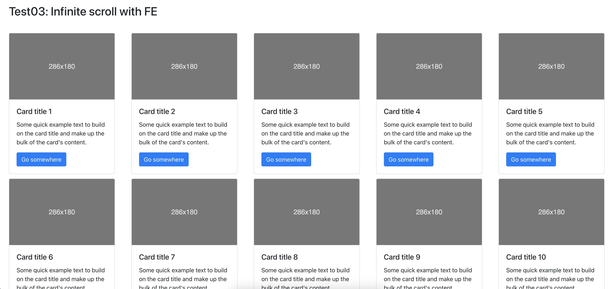

# Infinite scroll with FE

## App screen

## Requirement

- Give 100 items in a array.
- Only show 10 items first when the component first loaded.
- Continue to show 10 next items until runs out data when user scroll browser.

## Note

- You can use function or class component.
- You only write code in Test03.jsx
- You only use hooks api of react.
- Don't use any 3rd libs.

## Result

