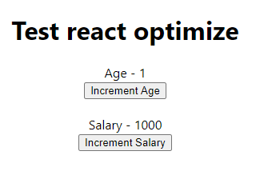
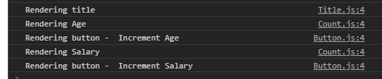
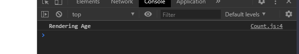
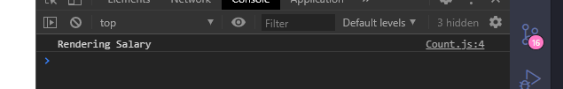
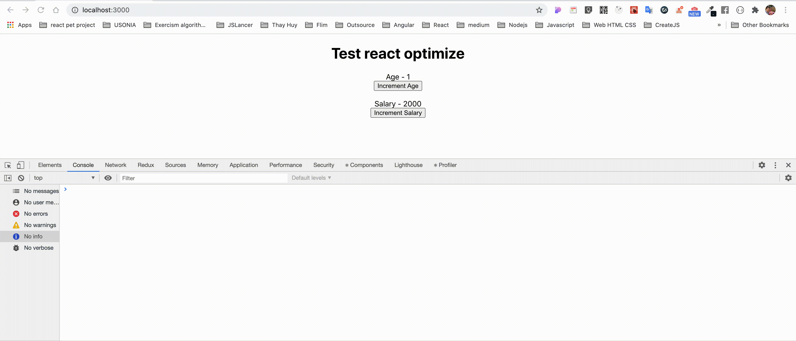

# How to optimize prevent re-render component

## Scripts

```bash
$ npm install

$ npm start
```

## App screen



### First load apps. It will render all components



## Action

- Click "Increment Age" button -> age + 1
- Click "Increment Salary" button -> salary + 1000

## Requirement

How to user click "Increment Age" button, it just re-render 'Age - x' component?. It will look like the result below.



The result same when user click "Increment Salary" button.



## Note

- You can't create new any component or move the position of components.

- You can only change code in that components.

## Result



- You can use function or class component.

- You can't create new any component or move the position of components. You can only change code in that components.
