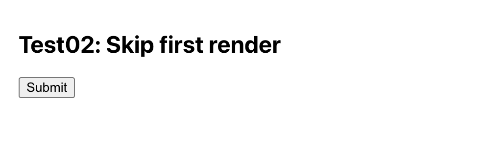
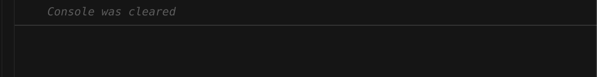
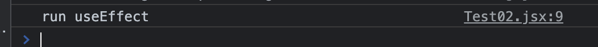
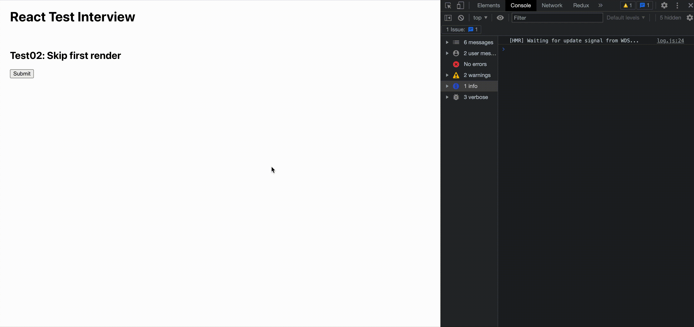

# How to skip first render component

## App screen

## Scenario

- `run effect` text won't print out when the component first loaded.

- It only print out when user click "Submit" button.

## Note

- You can use function or class component.
- You only write code in Test02.jsx
- You only use hooks api of react.

## Result

